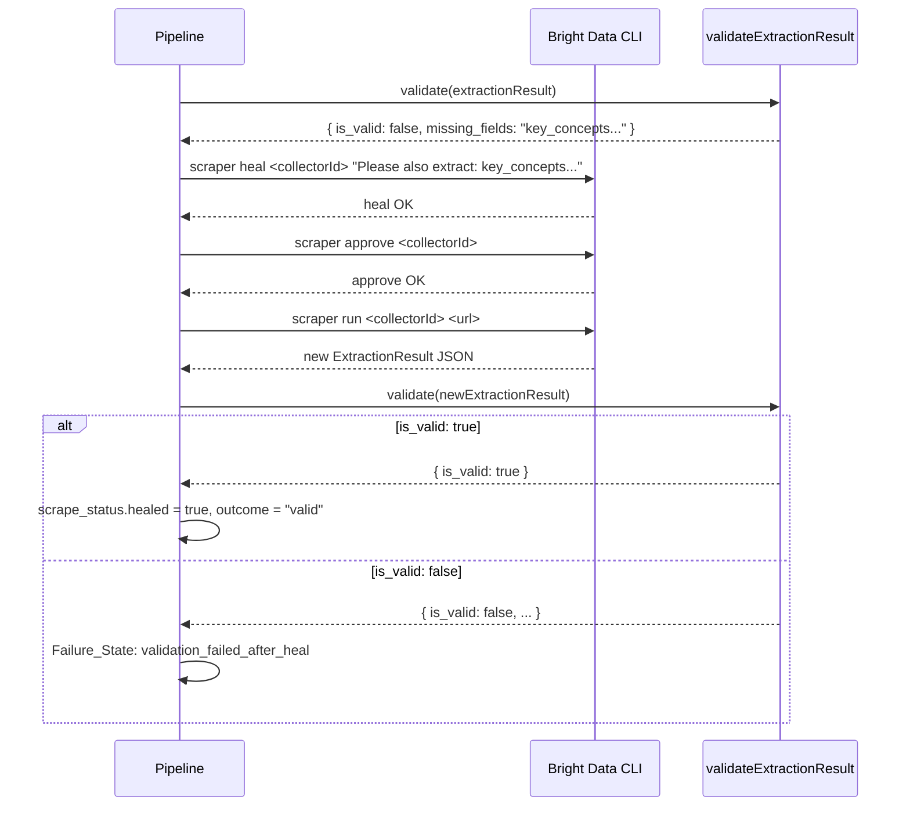

# Design Document: Bright Data Scraping Architecture

## Overview

This redesign promotes Bright Data Scraper Studio from a convenience wrapper into the unmistakable, non-negotiable evidence-collection engine for the Delta certification prep platform. The current implementation always starts with a Bing search even when official documentation URLs are already embedded in blueprint JSON files. That is backwards: Bing should only exist as a last-resort URL-discovery tool.

The new architecture enforces a strict evidence chain:

1. **Primary Path** — resolve a known official documentation URL from the blueprint, then scrape it directly with Bright Data. No Bing involved.
2. **Fallback Path** — only when no official URL is resolvable, use the existing Bing collector to discover a URL, then scrape *that URL* directly with Bright Data (never use Bing snippet text as evidence).
3. **Extraction Validation Gate** — Deterministic TypeScript structural check of Bright Data's extraction; no Groq call. Groq is used downstream for teaching generation and healing instructions only.
4. **Self-Healing Loop** — one heal → approve → re-run cycle when validation fails.
5. **No-Hallucination Contract** — HTTP 422 on pipeline failure; `buildFallbackTeachContent` is removed.

Every piece of teaching content must be traceable to a URL that Bright Data scraped. Groq reasons about facts it did not invent.

---

## Architecture

```mermaid
flowchart TD
    A([scrapeObjectiveContent]) --> B{Resolve Official_URL}

    B -->|skills[].official_doc_url found\nin Official_Domains| C[Primary Path]
    B -->|No official_doc_url;\nDerive from provider mapping| C
    B -->|Derivation fails| D[Fallback Path]

    subgraph C[Primary Path — path: primary]
        C1[getCollectorId\nhostname → doc_content] --> C2{Cached?}
        C2 -->|Yes| C3[scraper run collectorId url]
        C2 -->|No| C4[scraper create url prompt] --> C5[saveCollectorId] --> C3
    end

    subgraph D[Fallback Path — path: fallback]
        D1[scraper run Bing collector\nwww.bing.com → documentation_search] --> D2{Official URL\nin results?}
        D2 -->|No| D3[Failure_State\nno_official_url_found]
        D2 -->|Yes| D4[scraper run doc_content\ncollector on discovered URL]
    end

    C3 --> E[ExtractionResult JSON]
    D4 --> E

    E --> F{Extraction Validation Gate}
    F -->|is_valid: true| G[ScrapeStatus outcome: valid\nReturn ObjectiveScrapeResult]
    F -->|is_valid: false| H[Heal Loop]

    subgraph H[Self-Healing Loop — max once]
        H1[scraper heal collectorId\nmissing_fields prompt] --> H2[scraper approve collectorId]
        H2 --> H3[scraper run collectorId url]
        H3 --> H4{Extraction Validation\n2nd pass}
        H4 -->|is_valid: true| H5[healed: true]
        H4 -->|is_valid: false| H6[Failure_State\nvalidation_failed_after_heal]
    end

    H5 --> G
    H6 --> I[Failure_State propagation]
    D3 --> I

    G -->|Teach_Route| J[generateTeachContent\nGroq reasons from ExtractionResult]
    I -->|Teach_Route| K[HTTP 422\nextraction_failed]
    G -->|Update_Route| L[objective_done event\n+ scrape_status]
    I -->|Update_Route| M[objective_error event]
```

---

## Components and Interfaces

### `lib/ingestion/brightdata.ts` — Changes

The existing file is redesigned around a new internal orchestration function that replaces `executeScraperStudioFlow`.

#### Functions retained unchanged
- `isBrightDataConfigured()` — no change
- `scrapeWithBrightData(url)` — syllabus scraping, no change
- `runBDataCli(args, timeoutMs)` — no change
- `getCollectorId(hostname, type)` — no change
- `saveCollectorId(hostname, type, id)` — no change

#### Functions removed
- `extractCleanContent(rawJson, context)` — removed; Groq no longer post-processes raw content. The structured extraction prompt given to Bright Data produces a clean `ExtractionResult` directly.
- The four-step "Bing first" strategy inside `scrapeObjectiveContent` — replaced entirely.

#### Functions added / redesigned

**`resolveOfficialUrl(objective)`** — new pure function  
Resolves the Official_URL for an objective. Returns `string | null`.

```typescript
function resolveOfficialUrl(objective: ScrapeObjectiveInput): string | null
```

Priority:
1. Find first `skills[].official_doc_url` whose `new URL(url).hostname` is in `OFFICIAL_DOMAINS`
2. Fall back to `deriveUrlFromProvider(objective.cert_provider, objective.title)`
3. Return `null` if both fail

**`deriveUrlFromProvider(provider, objectiveTitle)`** — new pure function  
Constructs a best-effort documentation URL from the cert provider name and objective title.

```typescript
function deriveUrlFromProvider(
  provider: string | undefined,
  objectiveTitle: string
): string | null
```

Static mapping:

| Provider | Domain |
|---|---|
| `Microsoft` | `learn.microsoft.com` |
| `AWS` | `docs.aws.amazon.com` |
| `GCP` / `Google` | `cloud.google.com` |
| `HashiCorp` | `developer.hashicorp.com` |
| `Docker` | `docs.docker.com` |

URL pattern: `https://<domain>/search?q=<slug>` where `slug` is the objective title lowercased, spaces replaced with `+`. Returns `null` if provider is not in the mapping.

**`validateExtractionResult(data)`** — new pure function  
The Extraction Validation Gate. Performs a strict structural check on the parsed Bright Data output. This replaces the open-ended Groq validation prompt in `executeScraperStudioFlow`.

```typescript
function validateExtractionResult(data: unknown): ValidationResult
```

**`buildDocContentPrompt(objectiveTitle)`** — new pure function  
Returns the structured extraction prompt string sent to Bright Data when creating a `doc_content` collector. Centralised so the prompt is identical whether creating a new collector or referencing an existing one.

**`scrapeDocUrl(url, objectiveTitle)`** — new internal async function  
Handles the get-or-create + run cycle for a `doc_content` collector on a given URL. Returns `ExtractionResult`.

**`scrapeObjectiveContent(objective)`** — redesigned  
Now the top-level orchestrator implementing the full pipeline (URL resolution → Primary/Fallback path → Validation Gate → Heal Loop). Returns `ObjectiveScrapeResult`.

---

### `app/api/objectives/[id]/teach/route.ts` — Changes

- Remove `buildFallbackTeachContent` entirely (deleted, not silenced)
- Remove the `catch` block that swallows scrape errors and continues to generate content
- Add: if `scrape_status.outcome === "failed"` → return 422
- Add: `heal_badge` field when `scrape_status.healed === true`
- Add: `source_note` field when `scrape_status.path === "fallback"`
- Add: `scrape_status` field in all successful responses
- Change: `sources_used` field is always `"Bright Data Scraper Studio — <source_url>"`
- Change: when Groq is not configured, run scrape and persist, return early without 422

### `app/api/certifications/[id]/update/route.ts` — Changes

- Pass `cert.provider` (already present) and the objective's `skills` array into `scrapeObjectiveContent`
- On fulfilled result: include `scrape_status` in the `objective_done` event
- On fulfilled result where `scrape_status.healed === true`: prefix `message` with the Heal_Badge string
- On pipeline Failure_State: emit `objective_error` (already the rejected-promise path, but now also triggered by an explicit Failure_State return rather than a thrown exception)

---

## Data Models

### ExtractionResult

The structured JSON object Bright Data extracts from a documentation page.

```typescript
interface ExtractionResult {
  title: string;
  learning_outcomes: string[];
  key_concepts: Array<{ term: string; definition: string }>;
  api_names: string[];
  limits: string[];
  code_examples: string[];
}
```

### ScrapeStatus

Metadata attached to every scrape attempt.

```typescript
interface ScrapeStatus {
  path: "primary" | "fallback";
  source_confidence: "official_blueprint" | "provider_derived" | "fallback_discovered";
  healed: boolean;
  outcome: "valid" | "invalid" | "failed";
  source_url: string;
  failure_reason?: string;
}
```

- `path` is set at resolution time and never changes within a pipeline invocation.
- `source_confidence` is set at URL-resolution time: `official_blueprint` when the URL came from `Blueprint_JSON`, `provider_derived` when constructed by `deriveUrlFromProvider`, `fallback_discovered` when found via the Fallback_Path.
- `healed` starts `false`; set to `true` only after a successful second validation pass.
- `outcome` transitions: `invalid` (after first validation failure) → `valid` (after heal) or `failed` (after heal + second failure, or any hard failure).
- `failure_reason` is present only when `outcome === "failed"`. Possible values:
  - `"no_official_url_found"` — Fallback Path found no Official_Domains URL in Bing results
  - `"fallback_invocation_failed"` — Bing collector call threw an error
  - `"validation_failed_after_heal"` — second Groq validation pass returned `is_valid: false`
  - `"scraper_run_failed"` — Bright Data CLI threw during `scraper run`
  - `"missing_scrape_metadata"` — `ScrapeStatus` could not be fully assembled (Teach_Route only)

### ObjectiveScrapeResult (updated)

```typescript
interface ObjectiveScrapeResult {
  sources: Array<{ url: string; title: string; content: string }>;
  combinedContent: string;
  scrapeMethod: string;
  scrape_status: ScrapeStatus;
  extraction_result?: ExtractionResult;
}
```

`combinedContent` is the stringified `ExtractionResult` for downstream consumers that still read `combinedContent`. `scrapeMethod` is one of:
- `"brightdata-scraper-studio-primary"` — direct doc scrape, URL from blueprint or derivation
- `"brightdata-scraper-studio-fallback"` — URL discovered via Bing, then scraped directly

### ValidationResult

```typescript
interface ValidationResult {
  is_valid: boolean;
  missing_fields: string;
}
```

### ScrapeObjectiveInput (updated)

```typescript
interface ScrapeObjectiveInput {
  id?: string;
  title: string;
  description?: string;
  certification_id?: string;
  domain_title?: string;
  objective_code?: string;
  cert_title?: string;
  cert_provider?: string;
  skills?: Array<{ official_doc_url?: string; [key: string]: unknown }>;
}
```

The `skills` array is now passed in so `resolveOfficialUrl` can inspect blueprint data.

### Structured Extraction Prompt

Sent to `scraper create` for all `doc_content` collectors:

```
Extract the following from this documentation page as a JSON object:
{
  "title": "the page title",
  "learning_outcomes": ["what a developer will be able to do after reading this"],
  "key_concepts": [{ "term": "concept name", "definition": "one-sentence explanation" }],
  "api_names": ["SDK class names, REST endpoints, CLI commands mentioned"],
  "limits": ["quotas, rate limits, size constraints, regional restrictions"],
  "code_examples": ["copy any code snippets verbatim"]
}
Return only this JSON object.
```

---

## Extraction Validation Gate

### Design

The Extraction Validation Gate is a **pure structural check** — it does not generate, supplement, or interpret content. It answers exactly one question: "Does this `ExtractionResult` contain enough real data to ground teaching content?"

### Validation Logic

```
is_valid = true  iff:
  data.title is a non-empty string
  AND data.key_concepts is a non-empty array
  AND data.key_concepts[0].term is a non-empty string
  AND data.key_concepts[0].definition is a non-empty string
```

This is implemented as a pure TypeScript function (`validateExtractionResult`) with no Groq API call. The previous implementation sent a free-form Groq prompt to evaluate validity — that approach is replaced by this deterministic check. Groq calls are expensive and non-deterministic; structural validation is free and reliable.

> **Design decision**: The validation rule is fully deterministic (`title` non-empty, `key_concepts[0]` non-empty). A Groq call adds latency and cost with no benefit for this check. The `validateExtractionResult` TypeScript function fulfils the Groq_Validator contract while being faster, cheaper, and 100% reproducible.

### Validation Prompt for Heal (only Groq call in validation pathway)

When healing is triggered, the `missing_fields` string from `validateExtractionResult` is passed to `scraper heal`. This string is constructed deterministically:

```typescript
function buildMissingFieldsDescription(data: Partial<ExtractionResult>): string {
  const missing: string[] = [];
  if (!data.title) missing.push("title");
  if (!data.key_concepts?.length || !data.key_concepts[0]?.term) missing.push("key_concepts with term and definition");
  if (!data.learning_outcomes?.length) missing.push("learning_outcomes");
  return missing.join(", ");
}
```

### Output Contract

```typescript
interface ValidationResult {
  is_valid: boolean;
  missing_fields: string; // empty string when is_valid: true
}
```

`validateExtractionResult` never throws. On parse failure or unexpected shape, it returns `{ is_valid: false, missing_fields: "could not parse extraction result" }`.

---

## Self-Healing Loop

### Design

The Heal Loop is triggered when the first `validateExtractionResult` call returns `is_valid: false`. It runs **at most once per pipeline invocation** — a guard flag prevents recursive healing.

### Sequence



### Guard

```typescript
let healAttempted = false;

// Inside the pipeline, after first validation failure:
if (!healAttempted) {
  healAttempted = true;
  // ... heal sequence
}
// If healAttempted is already true, skip heal and go directly to Failure_State
```

### Heal CLI Command

```
scraper heal <collectorId> "Please also extract: <missing_fields>" --json
scraper approve <collectorId> --json
scraper run <collectorId> <url> --json
```

`missing_fields` is the exact string returned by `validateExtractionResult`.

---

## Error Handling and Failure_State Propagation

### Failure reasons and their origins

| Reason | Where triggered |
|---|---|
| `no_official_url_found` | Fallback Path: Bing results contain no Official_Domains hostname |
| `fallback_invocation_failed` | Fallback Path: Bing collector `scraper run` throws |
| `validation_failed_after_heal` | Heal Loop: second validation pass returns `is_valid: false` |
| `scraper_run_failed` | Primary or Fallback: doc `scraper run` throws |
| `missing_scrape_metadata` | Teach_Route: `ScrapeStatus` cannot be fully assembled |

### Propagation in `scrapeObjectiveContent`

`scrapeObjectiveContent` never throws for pipeline failures — it returns an `ObjectiveScrapeResult` with `scrape_status.outcome === "failed"` and `scrape_status.failure_reason` set. Callers check the outcome; they do not need try/catch for pipeline logic.

Exception: unexpected errors (e.g., process crash, OOM) still propagate as thrown exceptions. The Update_Route's `Promise.allSettled` handles those as `rejected` results.

### Propagation in Teach_Route

```typescript
const result = await scrapeObjectiveContent(objective);

if (result.scrape_status.outcome === "failed") {
  return NextResponse.json(
    {
      success: false,
      error: "extraction_failed",
      reason: result.scrape_status.failure_reason,
      scrape_status: result.scrape_status,
    },
    { status: 422 }
  );
}

if (!isGroqConfigured()) {
  // Persist result, skip teach content generation — not a failure
  await persistSources(result, objective.id);
  return NextResponse.json({ success: true, persisted: true, scrape_status: result.scrape_status });
}

// Proceed to teach content generation...
```

### Propagation in Update_Route

```typescript
for (const result of results) {
  if (result.status === "rejected") {
    // Unexpected exception (not a pipeline Failure_State)
    controller.enqueue(line({ type: "objective_error", message: `[-] ${obj.title} — ${result.reason?.message}`, ... }));
    failed++;
    continue;
  }

  const scrapeResult = result.value;

  if (!scrapeResult || scrapeResult.scrape_status.outcome === "failed") {
    controller.enqueue(line({
      type: "objective_error",
      message: `[-] ${obj.objective_code}. ${obj.title} — ${scrapeResult?.scrape_status?.failure_reason ?? "scrape failed"}`,
      objectiveId: obj.id,
      scrape_status: scrapeResult?.scrape_status,
      ...
    }));
    failed++;
    continue;
  }

  const healPrefix = scrapeResult.scrape_status.healed
    ? `[~] scraper healed — missing ${scrapeResult.scrape_status.missing_fields_recovered} recovered\n`
    : "";

  controller.enqueue(line({
    type: "objective_done",
    message: `${healPrefix}[+] ${obj.objective_code}. ${obj.title} — ${scrapeResult.scrapeMethod}`,
    objectiveId: obj.id,
    scrape_status: scrapeResult.scrape_status,
    ...
  }));
  succeeded++;
}
```

---

## Learner-Facing UX Design

### Progressive Disclosure Principle

The backend produces rich pipeline metadata, but learners should not be exposed to implementation details. The UI design follows a progressive disclosure pattern:

**Primary view (always visible):**
- Source label derived from `source_confidence`: "Official source", "Official-domain source discovered automatically", or "Official-domain source discovered via search"
- Scraping provider attribution: "Scraped by Bright Data Scraper Studio"
- Heal indicator (when `healed: true`): "Source extraction repaired automatically ✨"

**Secondary view (expandable "View source details"):**
- Full `source_url` link
- `path` value (`primary` / `fallback`)
- `scrapeMethod` string
- Raw `scrape_status` object (for debugging)

### Failure Message Translation

When the pipeline fails, the UI displays `user_message` (not the raw `reason` code):

| Technical `reason` | Learner-facing `user_message` |
|---|---|
| `no_official_url_found` | "We couldn't find official documentation for this topic right now." |
| `fallback_invocation_failed` | "We couldn't reach the documentation source right now. Please try again." |
| `validation_failed_after_heal` | "We found the source but couldn't extract the required information, even after an automatic repair attempt." |
| `scraper_run_failed` | "We couldn't retrieve the documentation page right now. Please try again." |
| `missing_scrape_metadata` | "An internal error occurred while verifying the source. Please try again." |

The raw `reason` field is still present in the response for logging but is not shown in the primary UI.

### Practice and Retrieval Loop

The Teach_Content response is the center of the product. The learner flow after a successful teach is:

```
Teach_Content displayed
       ↓
[ Check my understanding ]
       ↓
  Practice question
  (grounded in Extraction_Result)
       ↓
  Learner answers
       ↓
  Feedback + explanation
  (grounded in Extraction_Result)
       ↓
  Weak topic recorded (if incorrect)
       ↓
  Targeted reteach offered
  (emphasises common_mistakes + exam_tip)
```

Practice questions and feedback are generated by Groq using the same validated `ExtractionResult` as the teach step. The no-hallucination contract applies equally: no `ExtractionResult` → no practice question.

### Teach_Content as the Product Center

The `ExtractionResult` is an internal scraping artifact — it exists to ground Groq's reasoning. The `Teach_Content` response is what the learner interacts with:

```
what_it_is     → Simple explanation
analogy        → Relatable mental model
why_it_exists  → Motivation and context
how_it_works   → Mechanism
key_concepts   → Terms to remember
common_mistakes → Exam pitfalls
exam_tip       → One-liner to retain
```

The scraping pipeline is the evidence layer; `Teach_Content` is the product layer. Judges and learners should see `Teach_Content` first — scraping metadata is the trust signal shown underneath.

---

## Scraper Cache Management

### Cache file: `.bdata-scrapers.json`

Structure:
```json
{
  "www.bing.com": {
    "documentation_search": "c_mt10dg5i258f47a685"
  },
  "learn.microsoft.com": {
    "doc_content": "c_<generated>"
  },
  "docs.aws.amazon.com": {
    "doc_content": "c_<generated>"
  }
}
```

### Invariants

1. `www.bing.com → documentation_search → c_mt10dg5i258f47a685` is never overwritten.
2. New entries are always written under the `doc_content` type key (never under `documentation_search`).
3. Each documentation hostname gets exactly one `doc_content` collector (per hostname, not per URL path). This is a deliberate trade-off: one collector per hostname means the scraper prompt is tuned for that vendor's documentation structure.

### Lookup sequence for doc_content scrapers

```
1. collectorId = getCollectorId(hostname, "doc_content")
2. if collectorId → scraper run collectorId url
3. else:
     a. scraper create url prompt → get collectorId
     b. saveCollectorId(hostname, "doc_content", collectorId)  ← attempt, log if fails
     c. scraper run collectorId url
```

### Cache write failure handling

If `saveCollectorId` throws (e.g., disk full, permissions), the error is logged at `warn` level and the pipeline continues. The scrape will succeed; only the caching benefit is lost. On the next invocation for the same hostname, a duplicate collector will be created — acceptable as a rare edge case.

---

## Teach Route: Detailed Changes

### Before → After summary

| Behaviour | Before | After |
|---|---|---|
| Scrape failure | Silent fallback to `buildFallbackTeachContent` | HTTP 422 with `extraction_failed` |
| `buildFallbackTeachContent` | Present, called on any scrape error | Deleted entirely |
| `sources_used` | `"real documentation scraped via Bright Data"` or `"LLM training knowledge"` | `"Bright Data Scraper Studio — <source_url>"` |
| Heal indicator | Not present | `heal_badge` field in response |
| Fallback path indicator | Not present | `source_note` field in response |
| `scrape_status` in response | Not present | Always present in success and failure responses |
| Groq not configured | Returns 200 with fallback content | Runs scrape, persists, returns 200 with `persisted: true` |
| `generateTeachContent` input | `combinedContent` string (raw or enriched by Groq) | `ExtractionResult` fields directly |

### Response shape (success, primary path, not healed)

```json
{
  "success": true,
  "data": {
    "what_it_is": "...",
    "analogy": "...",
    "why_it_exists": "...",
    "how_it_works": "...",
    "key_concepts": [{ "term": "...", "definition": "..." }],
    "common_mistakes": ["..."],
    "exam_tip": "...",
    "sources_used": "Bright Data Scraper Studio — https://learn.microsoft.com/..."
  },
  "scrape_status": {
    "path": "primary",
    "source_confidence": "official_blueprint",
    "source_label": "Official source",
    "healed": false,
    "outcome": "valid",
    "source_url": "https://learn.microsoft.com/..."
  }
}
```

### Response shape (success, fallback path, healed)

```json
{
  "success": true,
  "data": { "..." },
  "scrape_status": {
    "path": "fallback",
    "source_confidence": "fallback_discovered",
    "source_label": "Official-domain source discovered via search",
    "healed": true,
    "outcome": "valid",
    "source_url": "https://docs.aws.amazon.com/..."
  },
  "heal_badge": "[~] scraper healed — missing key_concepts with term and definition recovered",
  "source_note": "Content URL discovered via Bing search; page scraped directly by Bright Data."
}
```

### Response shape (failure)

```json
{
  "success": false,
  "error": "extraction_failed",
  "reason": "no_official_url_found",
  "user_message": "We couldn't find official documentation for this topic right now.",
  "scrape_status": {
    "path": "fallback",
    "healed": false,
    "outcome": "failed",
    "source_url": "",
    "failure_reason": "no_official_url_found"
  }
}
```
HTTP status: 422

### `generateTeachContent` prompt changes

The prompt now receives the `ExtractionResult` fields explicitly rather than a freeform `combinedContent` string:

```typescript
async function generateTeachContent(
  objective: ScrapeObjectiveInput,
  extraction: ExtractionResult,
  sourceUrl: string
): Promise<TeachContent>
```

Prompt structure changes:
- `learning_outcomes`, `key_concepts`, `api_names`, `limits`, `code_examples` are each listed explicitly
- Empty arrays are passed as `null` with a note: "This field was not present in the documentation"
- Instruction added: "Derive facts only from the provided documentation data. Do not add details that are not present in the source data."
- `sources_used` is set by the route, not by Groq

---

## Update Route: Detailed Changes

### `scrapeObjectiveContent` call signature

The existing call in the Update_Route batch loop needs the `skills` array added:

```typescript
scrapeObjectiveContent({
  id: obj.id,
  title: obj.title,
  description: obj.description,
  certification_id: obj.certification_id,
  domain_title: obj.domain_title,
  objective_code: obj.objective_code,
  cert_title: cert.title,
  cert_provider: cert.provider,
  skills: obj.skills,  // ← new
})
```

The `skills` array must be loaded as part of `getObjectivesByCertId` or fetched separately. If the DB query doesn't return `skills`, the pipeline falls back gracefully to URL derivation.

### `objective_done` event (updated shape)

```json
{
  "type": "objective_done",
  "message": "[+] 1.1. Select Azure AI Service Tier — brightdata-scraper-studio-primary",
  "objectiveId": "obj-101",
  "index": 1,
  "total": 12,
  "scrape_status": {
    "path": "primary",
    "healed": false,
    "outcome": "valid",
    "source_url": "https://learn.microsoft.com/..."
  }
}
```

### `objective_done` event when healed

```json
{
  "type": "objective_done",
  "message": "[~] scraper healed — missing key_concepts recovered\n[+] 1.1. Select Azure AI Service Tier — brightdata-scraper-studio-primary",
  "objectiveId": "obj-101",
  "index": 1,
  "total": 12,
  "scrape_status": {
    "path": "primary",
    "healed": true,
    "outcome": "valid",
    "source_url": "https://learn.microsoft.com/..."
  }
}
```

### `objective_error` event (pipeline Failure_State)

```json
{
  "type": "objective_error",
  "message": "[-] 1.1. Select Azure AI Service Tier — no_official_url_found (will retry on next open)",
  "objectiveId": "obj-101",
  "index": 1,
  "total": 12,
  "scrape_status": {
    "path": "fallback",
    "healed": false,
    "outcome": "failed",
    "source_url": "",
    "failure_reason": "no_official_url_found"
  }
}
```

NDJSON event type set remains: `start`, `progress`, `objective_done`, `objective_warn`, `objective_error`, `done`.

---

## Correctness Properties

*A property is a characteristic or behavior that should hold true across all valid executions of a system — essentially, a formal statement about what the system should do. Properties serve as the bridge between human-readable specifications and machine-verifiable correctness guarantees.*

### Property 1: Primary path is always attempted first

*For any* objective that has at least one skill entry with an `official_doc_url` whose hostname is in `Official_Domains`, the pipeline SHALL resolve that URL and call `scraper run` on it directly, and the Bing collector SHALL NOT be invoked during that pipeline execution.

**Validates: Requirements 1.1, 1.4**

---

### Property 2: Official URL resolution selects first valid skill URL

*For any* objective with multiple skill entries (some with hostnames in `Official_Domains`, some not), `resolveOfficialUrl` SHALL return the URL of the first skill entry whose hostname is in `Official_Domains`, regardless of order or number of invalid entries that precede or follow it.

**Validates: Requirements 1.2**

---

### Property 3: Provider derivation returns correct domain

*For any* cert provider name in the static mapping (Microsoft, AWS, GCP, HashiCorp, Docker), `deriveUrlFromProvider` SHALL return a URL whose hostname exactly matches the mapped domain for that provider.

**Validates: Requirements 1.3**

---

### Property 4: ScrapeStatus path is always set correctly

*For any* pipeline execution, `scrape_status.path` SHALL be `"primary"` if `resolveOfficialUrl` returned a non-null URL, and `"fallback"` if the Fallback Path was invoked, and this value SHALL NOT change during the execution regardless of whether healing occurs.

**Validates: Requirements 1.5, 2.5**

---

### Property 5: Fallback path URL selection only returns Official_Domains hostnames

*For any* array of Bing search result objects, the URL extracted by the Fallback Path URL selector SHALL always have a hostname that is a member of `Official_Domains`, and if no such result exists in the array the result SHALL be a Failure_State with `failure_reason === "no_official_url_found"`.

**Validates: Requirements 2.2, 2.4**

---

### Property 6: ExtractionResult schema is always structurally complete

*For any* documentation URL scrape that does not throw, the returned `ExtractionResult` object SHALL contain all six required fields (`title`, `learning_outcomes`, `key_concepts`, `api_names`, `limits`, `code_examples`) with the correct TypeScript types (string, string[], Array<{term,definition}>, string[], string[], string[]).

**Validates: Requirements 3.1**

---

### Property 7: Cache hit prevents scraper create

*For any* hostname that already has an entry under the `doc_content` key in the Scrapers_Cache at the time `scrapeDocUrl` is called, the pipeline SHALL call `scraper run` directly and SHALL NOT call `scraper create` during that invocation.

**Validates: Requirements 3.3, 8.1, 8.2**

---

### Property 8: Bing cache entry is never overwritten

*For any* sequence of `saveCollectorId` calls for any set of hostnames and types, the entry `{ "www.bing.com": { "documentation_search": "c_mt10dg5i258f47a685" } }` SHALL remain present and unchanged in the Scrapers_Cache after each write.

**Validates: Requirements 8.3**

---

### Property 9: Validation gate output is strictly { is_valid, missing_fields }

*For any* value passed to `validateExtractionResult` — including valid `ExtractionResult` objects, partial objects, null, undefined, empty objects, and malformed JSON — the return value SHALL always be an object with exactly two fields: `is_valid` (boolean) and `missing_fields` (string), and SHALL NOT contain any additional fields or generated content.

**Validates: Requirements 4.1, 4.4**

---

### Property 10: Validation verdict matches structural criteria exactly

*For any* `ExtractionResult`-shaped object, `validateExtractionResult` SHALL return `is_valid: true` if and only if `title` is a non-empty string AND `key_concepts` is a non-empty array AND `key_concepts[0].term` is a non-empty string AND `key_concepts[0].definition` is a non-empty string; in all other cases it SHALL return `is_valid: false`.

**Validates: Requirements 4.1, 4.2**

---

### Property 11: Heal loop runs at most once per pipeline invocation

*For any* pipeline execution where the first validation pass returns `is_valid: false`, the `scraper heal` CLI command SHALL be invoked exactly once, regardless of how many subsequent validation passes return `is_valid: false`.

**Validates: Requirements 5.4**

---

### Property 12: Healed status is recorded iff second validation passes

*For any* pipeline execution where the Heal Loop runs and the second validation pass returns `is_valid: true`, `scrape_status.healed` SHALL be `true`. *For any* pipeline execution where the Heal Loop does not run, or the second validation pass returns `is_valid: false`, `scrape_status.healed` SHALL be `false`.

**Validates: Requirements 5.5**

---

### Property 13: Failure_State produces HTTP 422 with correct body shape

*For any* `failure_reason` string, when `scrapeObjectiveContent` returns a result with `scrape_status.outcome === "failed"`, the Teach_Route SHALL return a response with HTTP status 422 and a JSON body containing `success: false`, `error: "extraction_failed"`, `reason` equal to the `failure_reason`, and a `scrape_status` object.

**Validates: Requirements 6.1, 6.4**

---

### Property 14: ObjectiveScrapeResult always contains all required fields

*For any* pipeline execution (success or failure), the returned `ObjectiveScrapeResult` SHALL always contain `scrape_status`, `combinedContent`, `sources`, and `scrapeMethod` fields — never `undefined` for any of these four.

**Validates: Requirements 10.1**

---

### Property 15: Update Route emits correct event type per outcome

*For any* batch of objective scrape results containing a mix of successes and failures, each successful result SHALL produce exactly one `objective_done` event and each failed result SHALL produce exactly one `objective_error` event, with no objective producing both event types.

**Validates: Requirements 10.2**

---

### Property 16: Heal badge appears in objective_done message when healed

*For any* healed `ObjectiveScrapeResult` processed by the Update_Route, the emitted `objective_done` event's `message` field SHALL contain the Heal_Badge string `"[~] scraper healed — missing"`.

**Validates: Requirements 10.3, 7.1**

---

### Property 17: sources_used field matches Bright Data attribution format

*For any* valid `ExtractionResult` with a known `source_url`, the `sources_used` field in the Teach_Content response SHALL be exactly `"Bright Data Scraper Studio — " + source_url`.

**Validates: Requirements 9.4**

---

### Property 18: Empty ExtractionResult fields are passed as null in Groq prompt

*For any* `ExtractionResult` where one or more array fields (`learning_outcomes`, `api_names`, `limits`, `code_examples`) are empty arrays, the Groq prompt string constructed by `generateTeachContent` SHALL contain `null` (the string literal) for each of those fields rather than `[]` or an omitted key.

**Validates: Requirements 9.3**

---

### Property 19: scrape_status required fields are always present or trigger missing_scrape_metadata

*For any* scrape result processed by the Teach_Route, if the assembled `scrape_status` object is missing any of `path`, `healed`, `outcome`, or `source_url`, the route SHALL return a failure response with `reason: "missing_scrape_metadata"` rather than returning a response with a partial `scrape_status`.

**Validates: Requirements 7.3**

---

### Property 20: source_confidence is always set and immutable

*For any* pipeline execution, `scrape_status.source_confidence` SHALL be set to exactly one of `"official_blueprint"`, `"provider_derived"`, or `"fallback_discovered"` at URL-resolution time, and SHALL NOT change during the execution regardless of whether healing occurs or the pipeline fails.

**Validates: Requirements 1.6**

---

### Property 21: user_message is always present on failure responses

*For any* `failure_reason` string, when the Teach_Route returns a 422 response, the response body SHALL contain a `user_message` field whose value is a non-empty string from the translation map, and SHALL NOT be `undefined`, `null`, or an empty string.

**Validates: Requirements 11.1, 11.2**

---

### Property 22: Practice questions reference only valid Extraction_Results

*For any* pipeline execution where `scrape_status.outcome !== "valid"`, the practice question generation endpoint SHALL return HTTP 422 and SHALL NOT return any question content. *For any* execution where `scrape_status.outcome === "valid"`, the generated question content SHALL reference only concepts present in `Extraction_Result.key_concepts` and `Extraction_Result.learning_outcomes`.

**Validates: Requirements 12.2, 12.6**

---

## Error Handling

### Summary of error → response mappings

| Error condition | `scrapeObjectiveContent` outcome | Teach_Route | Update_Route |
|---|---|---|---|
| No URL resolvable, Bing finds nothing | `outcome: "failed"`, `failure_reason: "no_official_url_found"` | HTTP 422 | `objective_error` |
| Bing collector throws | `outcome: "failed"`, `failure_reason: "fallback_invocation_failed"` | HTTP 422 | `objective_error` |
| Doc `scraper run` throws | `outcome: "failed"`, `failure_reason: "scraper_run_failed"` | HTTP 422 | `objective_error` |
| First validation fails, heal succeeds | `outcome: "valid"`, `healed: true` | HTTP 200 + `heal_badge` | `objective_done` + Heal_Badge in message |
| First validation fails, heal + second validation fails | `outcome: "failed"`, `failure_reason: "validation_failed_after_heal"` | HTTP 422 | `objective_error` |
| `saveCollectorId` throws | Log warning, continue | Unaffected | Unaffected |
| Groq not configured | `outcome: "valid"` (scrape still runs) | HTTP 200, no teach content, `persisted: true` | `objective_done` |
| Unexpected thrown exception | Propagates as thrown exception | HTTP 500 | `Promise.allSettled` → rejected → `objective_error` |

### Logging conventions

- `[brightdata]` prefix for all log lines in `lib/ingestion/brightdata.ts`
- `[teach]` prefix for all log lines in the Teach_Route
- `[update]` prefix for all log lines in the Update_Route
- `info` level: normal flow milestones (URL resolved, collector reused, validation passed, healed)
- `warn` level: recoverable issues (cache write failed, heal attempted, second validation failed)
- Errors logged at `warn` before returning a Failure_State (no uncaught exceptions for pipeline failures)

---

## Testing Strategy

### Unit Tests

Focus on pure functions that implement the new pipeline logic:

- `resolveOfficialUrl` — test priority ordering (blueprint URL > derivation > null), Official_Domains filtering, multiple skills entries
- `deriveUrlFromProvider` — test all five mapped providers, unmapped provider returns null, case-insensitive matching
- `validateExtractionResult` — test valid objects, missing title, empty key_concepts, null/undefined input, extra fields ignored
- `buildMissingFieldsDescription` — test all combinations of missing fields produce correct description strings
- `buildDocContentPrompt` — snapshot test of the extraction prompt string
- Teach_Route response assembly — test `heal_badge` format, `source_note` presence, `scrape_status` completeness check
- `saveCollectorId` — test Bing entry preservation across multiple writes

### Property-Based Tests

Use [fast-check](https://github.com/dubzzz/fast-check) (TypeScript-native, zero dependencies beyond Jest/Vitest).

Each property test runs a minimum of **100 iterations**.

Tag format: `// Feature: brightdata-scraping-architecture, Property N: <property_text>`

Properties to implement as property-based tests (see Correctness Properties section for full statements):

| Property | Test arb (generator) | What varies |
|---|---|---|
| P2: URL resolution selects first valid skill URL | `fc.array(fc.record({ official_doc_url: fc.oneof(officialUrl, nonOfficialUrl) }))` | Number and order of official vs non-official skill URLs |
| P3: Provider derivation returns correct domain | `fc.constantFrom(...providerList)` | Provider name from the static mapping |
| P5: Fallback URL selection / Failure_State | `fc.array(fc.record({ url: fc.oneof(officialUrl, nonOfficialUrl) }))` | Mix of official and non-official result URLs |
| P8: Bing cache entry preserved | `fc.array(fc.tuple(fc.string(), fc.string(), fc.string()))` | Sequences of saveCollectorId calls |
| P9 + P10: Validation gate output and verdict | `fc.record({ title: fc.string(), key_concepts: fc.array(...), ... })` | All combinations of populated/empty fields |
| P11: Heal loop at most once | Mocked CLI + `fc.integer({ min: 1, max: 5 })` re-validation failures | Number of validation failures |
| P12: healed flag accuracy | `fc.boolean()` (second validation outcome) | Whether second validation passes |
| P13: HTTP 422 shape for all failure reasons | `fc.constantFrom(...failureReasons)` | All possible `failure_reason` values |
| P15: Event type per outcome | `fc.array(fc.oneof(successResult, failureResult))` | Mixed batches of successes/failures |
| P17: sources_used format | `fc.webUrl()` | Arbitrary source URLs |
| P18: null for empty fields | `fc.record({ learning_outcomes: fc.constant([]), ... })` | Combinations of empty/non-empty arrays |

### Integration Tests

Single-execution tests for behaviors that require the full CLI flow or external coordination:

- End-to-end scrape of a known URL using real Bright Data credentials (run only in CI with secrets)
- `scraper create → run → validate` sequence with a real documentation page
- Cache file round-trip: write, read back, verify Bing entry preserved
- Update_Route bulk scrape with 3 objectives in a single batch (mocked Bright Data, real NDJSON stream parsing)

### What PBT does NOT cover

- UI rendering of `heal_badge` and `source_note` in the frontend — snapshot/visual tests
- Groq prompt content quality — manual review and example-based tests
- NDJSON streaming format — example-based integration test with real stream parsing
- Database persistence of `saveScrapedSource` — example-based integration test
