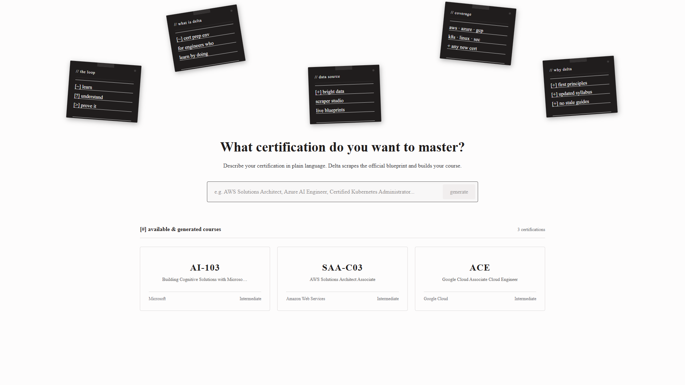

<h1 align="center">Delta</h1>

<p align="center">
  <strong>Certification prep environment for engineers.</strong><br>
  Describe a certification in plain language — Delta scrapes the official exam blueprint live, structures it into objectives, and builds a study course around it.
</p>

<p align="center">
  
</p>

---

## what it does

1. Takes a certification name as natural language input
2. Scrapes the official exam blueprint via Bright Data
3. Structures domains and objectives using Groq LLM
4. Generates lessons and practice questions per objective
5. Tracks readiness and gaps across the full syllabus

---

## stack

| layer | technology |
|---|---|
| framework | Next.js 16.3.1 (App Router) |
| language | TypeScript 5 |
| ui | React 19, Tailwind CSS 4 |
| database | SQLite + better-sqlite3 |
| auth | Better Auth 1.6 |
| ai | Groq SDK (`openai/gpt-oss-120b`) |
| scraping | Bright Data SDK + Cheerio |
| editor | Monaco Editor |

---

## system architecture

```
               [ User Natural Language Input ]
                              │
                              ▼
┌───────────────────────────────────────────────────────────┐
│                    Next.js App Router                     │
│           (React 19, Tailwind 4, Framer Motion)           │
└─────────────────────────────┬─────────────────────────────┘
                              │
              ┌───────────────┴───────────────┐
              ▼                               ▼
┌───────────────────────────┐   ┌───────────────────────────┐
│     Ingestion Engine      │   │    Persistence & Auth     │
│ Bright Data SDK + Cheerio │   │ Better Auth + SQLite (WAL)│
└─────────────┬─────────────┘   └───────────────────────────┘
              │ (Raw Blueprints & Docs)
              ▼
┌───────────────────────────────────────────────────────────┐
│                      Groq AI Engine                       │
│    (Dynamic Fallback: gpt-oss-120b / Llama-3.3-70b)       │
└─────────────────────────────┬─────────────────────────────┘
                              │ (Structured Blueprint JSON)
                              ▼
┌───────────────────────────────────────────────────────────┐
│                   Adaptive Study Loop                     │
│  • Domain & Objective Synthesis                           │
│  • Interactive Lessons & Code Labs                        │
│  • Exam-Standard Practice Questions                       │
│  • Readiness Alignment (Coverage + Freshness + Practice)  │
└───────────────────────────────────────────────────────────┘
```

### core subsystems

1. **Ingestion & Web Scraping Pipeline (`lib/ingestion/`)**:
   - Fetches live certification blueprints directly from vendor portals (AWS, Microsoft, GCP, CNCF, HashiCorp).
   - Combines Bright Data Web Unlocker / Scraper Studio CLI with Cheerio parsing to keep syllabus data fresh and resilient.

2. **AI Synthesizer & Groq Orchestration (`lib/groq.ts`)**:
   - Uses Groq SDK with automatic dynamic model discovery (`openai/gpt-oss-120b`) and fallback routing.
   - Cleans and converts unstructured HTML/Markdown into validated JSON schemas for domains, learning outcomes, key technical concepts, and practice questions.

3. **Data Persistence Layer (`lib/db/`)**:
   - High-performance SQLite database driven by `better-sqlite3` with Write-Ahead Logging (WAL) and strict foreign key enforcement.
   - Houses user accounts, active sessions, syllabus structures, user progress tracking, and readiness metrics.

4. **Authentication & Session Management (`lib/auth.ts`)**:
   - Powered by Better Auth 1.6 with secure email/password and session token validation across server components and API handlers.

5. **Adaptive Learning & Alignment Engine (`app/api/`)**:
   - Calculates real-time readiness scores combining Syllabus Coverage, Content Freshness, and Practice Mastery.
   - Triggers interactive verification checks ("Prove to Skip") and unlocks mock exams automatically when thresholds are reached.

---

## project structure

```
delta/
├── app/
│   ├── (auth)/                 # sign-in, sign-up
│   ├── (dashboard)/            # main app views
│   │   ├── page.tsx            # home — cert input + course list
│   │   ├── prep/               # cert prep hub
│   │   ├── certifications/     # certification detail view
│   │   ├── learn/              # objective lesson view
│   │   ├── practice/           # practice questions
│   │   ├── loop/               # study loop interface
│   │   ├── alignment/          # readiness alignment
│   │   └── settings/           # user settings
│   ├── api/
│   │   ├── auth/               # better-auth handlers
│   │   ├── certifications/     # CRUD + stats + progress + graph
│   │   ├── generate/           # blueprint scrape + course generation
│   │   ├── objectives/         # lessons + questions + teaching
│   │   ├── questions/          # question submission + grading
│   │   ├── alignment/          # readiness scoring
│   │   ├── alerts/             # user alerts
│   │   ├── sources/            # content sources
│   │   └── scrape/             # raw scrape endpoint
│   └── _components/            # Sidebar, Navbar, Badge, Button, Card
├── lib/
│   ├── db/                     # SQLite schema, queries, seed
│   ├── ingestion/              # Bright Data scraping client
│   ├── auth.ts                 # Better Auth config
│   ├── groq.ts                 # Groq client
│   └── types.ts                # shared TypeScript types
├── data/
│   └── blueprints/             # local cert blueprint JSON files
├── .env.example
└── DESIGN.md                   # design system spec
```

---

## getting started

### prerequisites

- Node.js v20+
- npm v10+
- [Groq API key](https://console.groq.com/)
- [Bright Data API key](https://brightdata.com/) (optional — falls back to Cheerio)

### setup

```bash
git clone https://github.com/yourusername/delta.git
cd delta
npm install
cp .env.example .env
```

Fill in `.env`:

```env
GROQ_API_KEY=gsk_...
GROQ_MODEL=openai/gpt-oss-120b
BETTER_AUTH_SECRET=your_secret_here
BETTER_AUTH_URL=http://localhost:3000
BRIGHT_DATA_API_KEY=...
BRIGHT_DATA_ZONE=web_unlocker1
```

### seed the database (optional)

```bash
npx tsx lib/db/seed.ts
```

### run

```bash
npm run dev
```

Open [http://localhost:3000](http://localhost:3000).

---

## scripts

```bash
npm run dev      # development server
npm run build    # production build
npm run lint     # eslint
npm test         # run tests
```

---

## license

This project is licensed under the [MIT License](LICENSE).