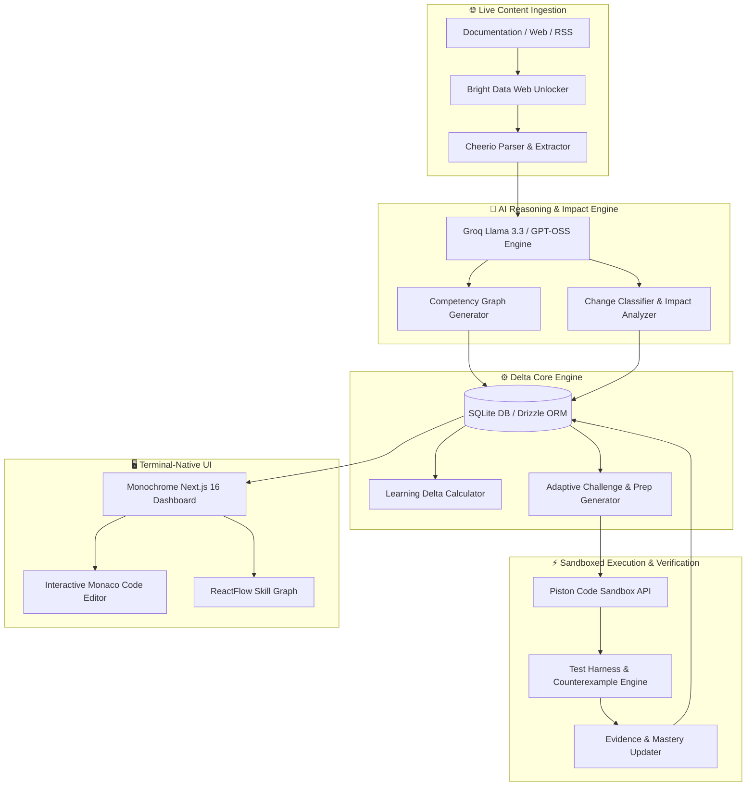

```
     _   _____  _     _____  _    
    / \ |  ___|/ \   |_   _|/ \   
   / _ \| |_  / _ \    | | / _ \  
  / ___ \  _|/ ___ \   | |/ ___ \ 
 /_/   \_\_|/_/   \_\  |_/_/   \_\
                                  
   D E L T A  --  K N O W L E D G E  &  S K I L L  E N G I N E
```

> **Delta** is a terminal-native, high-precision technical learning & skill graph platform built for software engineers, systems architects, and technical teams to master rapidly evolving technology ecosystems.

---

[](https://nextjs.org/)
[](https://react.dev/)
[](https://www.typescriptlang.org/)
[](https://groq.com/)
[](https://brightdata.com/)
[](LICENSE)

---

## 📌 Executive Summary

Modern software engineering moves faster than human documentation processing speed. Frameworks update breaking APIs overnight, foundation models evolve monthly, and protocols change rapidly.

**Delta** bridges the gap between raw documentation releases and practical engineering mastery:

1. **Scrapes & Ingests** live documentation, release notes, and technical blogs via Bright Data & Cheerio.
2. **Analyzes Technical Impact** using Groq-hosted LLMs to classify change severity (`breaking`, `new_capability`, `deprecated`).
3. **Builds Directed Competency Graphs** mapping skill dependencies, confidence metrics, and prerequisite nodes.
4. **Calculates Learning Deltas** to pinpoint exact missing knowledge hours when tech stacks shift.
5. **Generates Sandboxed Challenges & Adaptive Lessons** using Piston code execution and automated counterexample evaluation.

---

## 🏗️ System Architecture



---

## ✨ Key Features & Capability Modules

### 1. 🌐 Bright Data Web Ingestion Architecture
- **Web Unlocker & Proxy Pool Integration**: Automated scraping of enterprise technical documentation, GitHub releases, and blog posts with rate-limiting resilience.
- **Self-Healing Fallback Pipeline**: Uses cheerio DOM cleaning for structured text extraction with native fallback when proxy services are unconfigured.

### 2. 🧠 Directed Competency & Skill Graph Engine
- **Automated DAG Generation**: Transforms learning objectives into 15–25 node competency graphs with directional relationships (`prerequisite`, `optional`, `specialization`, `shared`).
- **Real-Time Evidence Tracking**: Updates node status (`not_started` ➔ `partial` ➔ `proven` ➔ `stale`) based on verified challenge submissions.

### 3. ⚡ Learning Delta & Effort Estimation Engine
- **Automated Gap Calculation**: Compares change impact vectors against current user competency nodes.
- **Topological Learning Sequences**: Prioritizes prerequisite skills before dependent concepts and calculates total required study hours.

### 4. 🧪 Sandboxed Code Verification & Counterexamples
- **Piston Sandbox Integration**: Executes user code in isolated containers across Python, TypeScript, Go, Rust, and JavaScript.
- **Counterexample Diagnostics**: When a test fails, the Groq engine analyzes trace logs and generates concrete input/output counterexamples to guide learning.

### 5. 🎯 Adaptive Prep Loop & Socratic Learning
- **Interactive Teaching AI**: Generates targeted bite-sized lessons tailored to user confidence levels.
- **Dynamic Question Synthesis**: Constructs multi-format questions (multiple choice, code correction, implementation) to validate deep technical comprehension.

### 6. 🎨 Monochrome Terminal Aesthetics
- Built strictly according to the **Berkeley Mono Terminal Design System** (`#fdfcfc` canvas, `#201d1d` ink, 4px corner radii, bracketed ASCII indicators). Zero clutter, maximum density.

---

## 🛠️ Tech Stack & Dependencies

| Layer | Technology | Description |
|---|---|---|
| **Framework** | Next.js 16.3.1 (App Router) | Server Components, Route Handlers, Turbopack support |
| **Frontend UI** | React 19, Tailwind CSS 4 | Monospaced UI layout with custom design primitives |
| **Graph Visuals** | ReactFlow 11 | Directed acyclic graph rendering for skill networks |
| **Editor** | Monaco Editor | Code editor component with syntax highlighting |
| **Database** | SQLite + Drizzle ORM | High-performance, zero-latency local relational store |
| **Authentication**| Better-Auth 1.6 | Cookie-based session authentication engine |
| **AI LLM Client** | Groq SDK (`llama-3.3-70b-versatile` / `gpt-oss-120b`) | High-speed LLM inference |
| **Scraper** | Bright Data SDK + Cheerio | Web scrapers & HTML text normalization |
| **Execution** | Piston Sandbox API | Multi-language remote code execution runner |

---

## 📂 Project Structure

```
delta/
├── app/                        # Next.js 16 App Router pages & APIs
│   ├── (auth)/                 # Authentication views (sign-in, sign-up)
│   ├── (dashboard)/            # Dashboard view routes
│   │   ├── challenges/         # Coding challenge interface
│   │   ├── changes/            # Technical change monitor
│   │   ├── explore/            # Objective exploration
│   │   ├── goals/              # Learning goal management
│   │   ├── history/            # Activity timeline & submission logs
│   │   ├── loop/               # Active learning loop interface
│   │   ├── practice/           # Interactive code practice
│   │   ├── prep/               # Adaptive interview/prep session
│   │   ├── progress/           # Analytics & heatmap dashboard
│   │   ├── skill-graph/        # Interactive ReactFlow competency graph
│   │   ├── sources/            # Content ingestion source manager
│   │   ├── to-review/          # Stale skill review queue
│   │   └── understand/         # Learning delta breakdown
│   ├── _components/            # Shared UI components (Navbar, Sidebar, Cards)
│   └── api/                    # RESTful Route Handlers
│       ├── auth/               # Better-Auth integration endpoints
│       ├── certs/              # Certification update endpoints
│       ├── challenges/         # Challenge execution & submission APIs
│       ├── changes/            # Technical change analysis APIs
│       ├── competency/         # Skill graph nodes & edges APIs
│       ├── delta/              # Learning delta computation endpoints
│       ├── generate/           # AI content generation routes
│       ├── goals/              # Goal management routes
│       ├── objectives/         # Socratic teaching & question APIs
│       └── sources/            # Content ingestion routes
├── lib/                        # Core business logic & engines
│   ├── db/                     # Drizzle ORM database schemas & seeders
│   │   ├── index.ts            # SQLite client connection
│   │   ├── queries.ts          # Database CRUD query functions
│   │   ├── schema.ts           # Relational table definitions
│   │   └── seed.ts             # Demo data generator
│   ├── engines/                # AI reasoning & execution engines
│   │   ├── challenge-engine.ts # Adaptive challenge generator
│   │   ├── change-engine.ts    # Change impact analyzer
│   │   ├── competency-engine.ts# Competency graph generator
│   │   ├── delta-engine.ts     # Learning delta calculator
│   │   └── verification-engine.ts# Sandbox execution & evidence recorder
│   ├── ingestion/              # Data collection services
│   │   ├── brightdata.ts       # Bright Data proxy scraping client
│   │   └── scraper.ts          # Fallback Cheerio HTML scraper
│   ├── sandbox/                # Code execution runners
│   │   └── piston.ts           # Piston remote API execution client
│   ├── auth.ts                 # Better-auth configuration
│   ├── groq.ts                 # Groq LLM client wrapper
│   └── types.ts                # TypeScript interface definitions
├── .bdata-scrapers.json        # Bright Data scraper zone mapping
├── .env.example                # Environment variables template
├── DESIGN.md                   # Terminal-native design specification
└── package.json                # Project dependencies & scripts
```

---

## ⚡ Quickstart Guide

### Prerequisites
- **Node.js**: `v20.x` or higher
- **npm**: `v10.x` or higher
- **Groq API Key**: Obtain from [Groq Console](https://console.groq.com/)

### 1. Clone & Install
```bash
git clone https://github.com/devanshindepth/delta.git
cd delta
npm install
```

### 2. Configure Environment Variables
Copy `.env.example` to `.env.local` and add your API keys:

```bash
cp .env.example .env.local
```

Edit `.env.local`:
```env
GROQ_API_KEY=gsk_your_groq_api_key_here
GROQ_MODEL=llama-3.3-70b-versatile
BETTER_AUTH_SECRET=your_super_secret_auth_key
BETTER_AUTH_URL=http://localhost:3000
BRIGHT_DATA_API_KEY=your_bright_data_api_key_here
BRIGHT_DATA_ZONE=web_unlocker1
```

### 3. Run Database Migrations & Seed Data (Optional)
```bash
npx tsx lib/db/seed.ts
```

### 4. Launch Development Server
```bash
npm run dev
```

Visit [`http://localhost:3000`](http://localhost:3000) to open the Delta dashboard.

---

## 🧪 Testing & Quality Assurance

Delta includes test scripts for verifying scrapers, API endpoints, and type checking:

```bash
# Run TypeScript compilation check
npx tsc --noEmit

# Run unit & integration tests
npm test
```

---

## 📜 API Reference Summary

| Endpoint | Method | Description |
|---|---|---|
| `/api/goals` | `GET` / `POST` | List learning goals or initialize new goal graph |
| `/api/competency` | `GET` | Retrieve nodes and edges for a competency graph |
| `/api/changes` | `GET` / `POST` | Ingest URL and analyze technical change impact |
| `/api/delta` | `GET` | Calculate current learning delta and effort hours |
| `/api/challenges/[id]/submit` | `POST` | Execute user code in Piston sandbox and verify tests |
| `/api/sources/[id]/ingest` | `POST` | Trigger Bright Data / Cheerio scraper on a source URL |
| `/api/objectives/[id]/teach` | `POST` | Generate interactive Socratic lesson content |
| `/api/objectives/[id]/question` | `GET` / `POST` | Generate or grade objective practice questions |

---

## 📄 License

Distributed under the MIT License. See `LICENSE` for more information.

---

<p align="center">
  <b>Delta</b> — Master the Delta of Technology.
</p>

